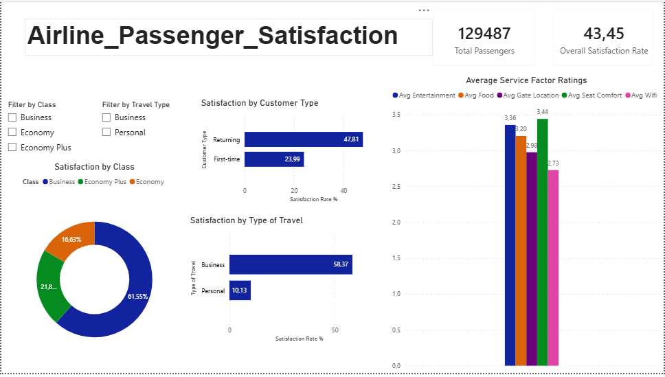

# ✈️ Airline Passenger Satisfaction Analysis

## Project Overview
Analysis of 129,487 airline passenger satisfaction survey records using MySQL 
and Power BI. The goal was to identify key drivers of satisfaction and 
dissatisfaction to support strategic business decisions.

## Tools Used
- **MySQL** — data cleaning and querying
- **Power BI** — interactive dashboard

## Business Questions Answered
1. What percentage of passengers are satisfied overall?
2. Does satisfaction vary by customer type?
3. Does satisfaction vary by type of travel?
4. Which class of travel has the highest satisfaction?
5. Which service factors drive satisfaction the most?
6. Which service factors perform the worst?

## Key Insights
- ✈️ Only **43.45%** of passengers are satisfied — the majority are unhappy
- 👤 **First-time passengers** are significantly less satisfied (23.99%) vs returning (47.81%)
- 💼 **Business travellers** are far more satisfied (58%) than personal travellers (10%)
- 🪑 **Business class** leads satisfaction at 69% vs Economy at just 19%
- 📱 **Online Boarding** has the biggest gap between satisfied and dissatisfied passengers
- 📶 **In-flight Wifi** is the worst rated service factor at 2.73 out of 5
- 🛫 **Long haul passengers** are more satisfied (77%) than short haul (33%)

## Strategic Recommendations
- Urgently improve the online boarding system — biggest impact on satisfaction
- Invest in better in-flight wifi — lowest rated factor across all passengers
- Address the personal traveller experience — only 10% satisfied
- Focus short haul service improvements to close the distance satisfaction gap

## Dashboard Preview

## SQL Queries
All queries are available in the `queries.sql` file in this repository.
